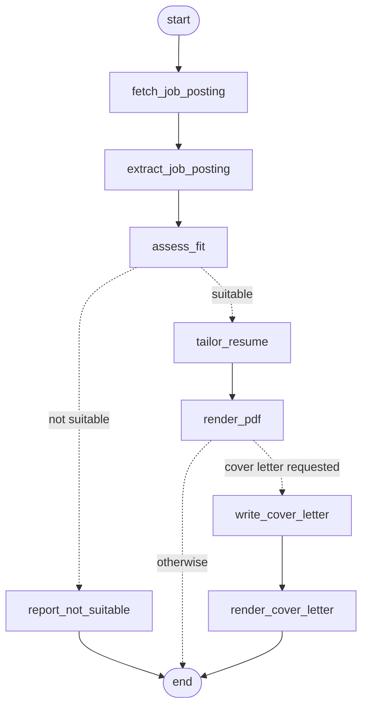

# Resume Curator Agent


A LangGraph agent that takes a job posting URL and your master resume, decides whether you are a realistic fit, and if so writes a one-page tailored resume (and optionally a cover letter) as PDFs.


## How it works



1. **fetch_job_posting** downloads the posting text.
2. **extract_job_posting** pulls out structured fields with a Pydantic schema: company, title, required and preferred skills, dates, and any work-authorization or sponsorship language, quoted word for word.
3. **assess_fit** uses structured LLM output to decide whether the master resume fits the posting, with reasoning that labels each gap as major or minor. If it is not a fit, the run stops and prints the reasoning instead of producing a resume.
4. **tailor_resume** rewrites the master resume for the posting: reorders bullets, mirrors the posting's terminology where it is honestly true, and cuts low-relevance sections to fit one page.
5. **render_pdf** converts the markdown to HTML and prints it to PDF with headless Chrome.
6. Optionally, **write_cover_letter** drafts a letter and **render_cover_letter** renders it to PDF, plus a plain-text copy for application forms that use a text box.

## Keeping it honest

The agent is instructed to use only facts that appear in the master resume: no invented employers, metrics, titles, or skills, and every link in a kept entry must be preserved. For the resume, these rules live in the prompt.

The cover letter goes further: after each draft, plain Python checks it for em dashes, length (230 to 320 words), paragraph count, stock openers, and banned words. If it fails, the model sees its own draft plus the exact problems and rewrites it, up to three attempts.

## Setup

Requires Python 3.12, [uv](https://docs.astral.sh/uv/), Google Chrome (macOS), and an Anthropic API key.

```bash
git clone https://github.com/derinozkan2029/resume-curator-agent.git
cd resume-curator-agent
uv sync && cp .env.example .env
```

Then put your key in `.env`.

## Usage

```bash
uv run python resume_agent.py
```

You will be asked for the path to your master resume, the job posting URL, and whether you also want a cover letter. Results are written to `workspace/output/`.

## Your master resume

A markdown file: first line `# Name (pronouns)`, second line your contact details, then sections such as Education, Experience, Projects, Skills. HTML comments are stripped before the model sees it. See `examples/sample_master.md` for the format. Your own master resume and everything the agent generates are gitignored.

## Tests

```bash
uv run pytest
```

The tests cover the cover letter rule checks. CI runs them on every push.

## Limitations

- macOS only: the Chrome path is hardcoded.
- Job fetching currently depends on LinkedIn's page structure and returns an empty description on other sites.
- The tailored resume is always written to `workspace/output/tailored_resume.pdf`, so each run overwrites the last.
- Resume content is checked by the prompt, not by code (see Roadmap).
- Output varies between runs.

## Roadmap

- Verify every number, URL, and title in the output against the master resume
- Score keyword coverage against the posting
- Re-prompt automatically when the PDF runs past one page
- Evaluate on a saved set of postings and report pass rates
